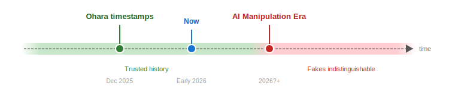
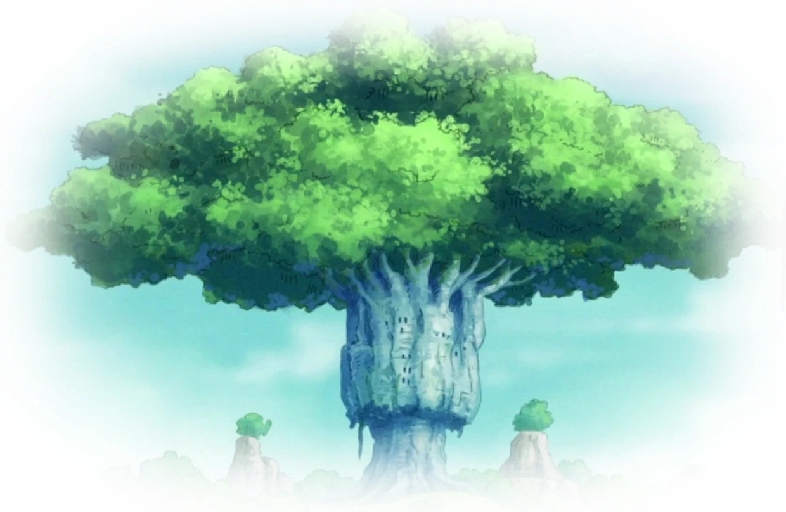

# Ohara

**_NOTE: The author is not a cryptographer and the code was not reviewed so it could contain errors or bugs which could invalidate timestamp proofs. If you find any please let us know._**

_The .zip file in the metadata folder is not meant to be unzipped. The zip contains over a million small files which, if unzipped, would occupy significantly more than 500MB of space depending on the filesystem you use._

Ohara is a timestamp collection of Internet Archive's video hashes using Bitcoin's blockchain via OpenTimestamps. This creates verifiable proof that specific videos existed before AI-generated deepfakes became prevalent, preserving a trusted record of historical video data.



## Motivation

Creating a digital copy of real-world data is easy, but how do we know the copy is authentic? The problem lies in how cheap it is to `edit` that copy. Text is trivial to modify, we just open a file and type. Sound is quite a bit harder. Making someone say something different from 3:47-4:09 is not an easy task. But it turns out that AI has become an efficient and cheap `edit` function, turning what was a strict 1-1 mapping between real-world sounds and digital captures into a 0-many relationship. A single digital sound "capture" can now have zero real-world equivalents and infinitely many variants.

Video remains the last widespread signal that's still hard to edit convincingly. Given the fast advancement of AI, we're likely just years away from cheap, indistinguishable video forgeries flooding the internet. For the first time in history, civilization will struggle to trust the signal we see and hear. Note that the (raw) signal being a lie is different than the interpretation of the signal data being a lie. The later lies have a long history, it's only the former that's new to us. Evolution didn't prepare us for this. While some fakes will be obvious, countless others won't be.

### A world of copies

The low cost of edit will not affect only new videos, but we'll also become unable to tell what videos from the past were the "correct" ones. Why would anyone flood the world with false copies of past data? To manipulate collective thinking, create knowledge asymmetry (only the forger knows what's original e.g. for AI training), or many other reasons we haven't yet imagined. 

Can we do something about it? Can the civilization of today point a finger at a video and say "This is the real one."? Perhaps a bit counterintuitively, the answer is that we can. We want to bring back a signal we can trust, but we don't want to rely on trusting any particular individual. What if we proved a video existed *before* the cost of editing dropped low enough to fake it? For this we need a trustworthy timeline. Bitcoin fits this criteria since creating an event in its timeline requires immense energy, but more importantly, *editing* an event requires the same energy because we need a new, equally hard block. This makes history rewrites too energy intensive to see them happen in practice.

We can use Bitcoin as a timestamping server to label original video data before we enter the era of cheap fakes. This preserves not just the videos themselves, but our ability to analyze them and reach correct, untampered conclusions. A simple example is AI analyzing the murder of a celebrity from different unmodified video sources and finding lies in reporting due to new observations that the human eye/mind missed.

## Installation

```
pip3 install .
```

You will also need a Bitcoin node running so that you can verify OpenTimestamps proofs. We recommend running the [Bitcoin Core](https://bitcoin.org/en/download) client. You can run the Core client with

```
bitcoind -dbcache=4096 -prune=550 -listen=0 -blocksonly
```

The time to sync depends on many factors including your connection and your peers.

You can also use [just](https://github.com/casey/just) to run common commands. Run `just` to see available recipes.

### Usage


We can view the timestamped hashes for a given identifier by running:

```
ohara read <identifier>
```

for example for identifier `WideScreenKaleidoscopeClip-Release44Clip6` we run:

```
ohara read WideScreenKaleidoscopeClip-Release44Clip6
```

We can also find the block at which this identifier was timestamped:

```
ohara read WideScreenKaleidoscopeClip-Release44Clip6 --verify
```

It's also possible to verify all the collection identifier files with:

```
ohara verify
```

Note that verifying everything tells you nothing about the hashes that were actually timestamped.

### Exporting .ots proofs

We can export a standalone OpenTimestamps proof for any identifier. This creates a self-contained `.ots` file that anyone can verify independently without needing the full collection:

```
ohara gen-ots <identifier1> <identifier2> ... <identifierN>
```

For example:

```
ohara gen-ots WideScreenKaleidoscopeClip-Release44Clip6
```

This creates two files:
- WideScreenKaleidoscopeClip-Release44Clip6.txt
- WideScreenKaleidoscopeClip-Release44Clip6.txt.ots

The `.txt` file has an entry with the following structure `<filename>,<sha1?>,<md5?>,<crc32?>` for each video file that was timestamped. The `.ots` file contains the complete proof chain: from the metadata through the Merkle tree to the Bitcoin block. Anyone with these two files can verify the timestamp:

```
ots verify WideScreenKaleidoscopeClip-Release44Clip6.txt.ots
```

Don't forget that ots verify requires access to a running Bitcoin node.


## Prior work

I'm not aware of all the work that's been done, but I did find some work from Peter Todd who timestamped the Internet Archive data. His archive is much larger and I believe it timestamps every SHA1 hash up to 2017 or 2018. The archive of timestamp proofs has been uploaded to the Internet Archive itself and is publicly available for [download](https://archive.org/details/opentimestamp-internetarchive-dataset). I encourage everyone to download it to help distribute the data.


## Questions

**Isn't SHA1 broken?**

Partially. What's important in a project like this one is that the preimage attacks are not feasible.

**I see MD5 and CRC32 hashes. Why are we timestamping this?**

Read the question below.

**What happens when SHA1 preimage attacks become feasible?**

We timestamp a triplet of hashes (SHA1, MD5, CRC32) so if computing a SHA1 preimage is relatively expensive, the fact that we have two other hash functions that have to produce the same result makes a successful attack even more expensive which can potentially buy us time.

But what we should do is timestamp the videos with a better hash function like SHA256. If we do this before SHA1 is completely broken, then our SHA256 timestamps can use the SHA1 timestamped dates in a secure way. How and why this is possible is explained in [this document](timestamp_chains.md).

**Why are you storing hashes in hex? Wouldn't it be more space-optimal to store byte digests?**

Yes, it would. Any and all transformations of data can still be done at a later point including more efficient archiving or replacing hex digests with raw digests and converting to hex on the fly.

**Why the name ohara?**

Ohara is a reference to an island from One Piece. It was home to archaeologists dedicated to uncovering and preserving historical truth. Their library, the Tree of Knowledge, held centuries of accumulated knowledge. The island was destroyed by those who wanted history erased and rewritten.

This project shares that spirit: preserving a verifiable record of what existed before video history can be manipulated. The difference is that our Tree of Knowledge is anchored in Bitcoin's blockchain which makes it a record that can't be burned.


